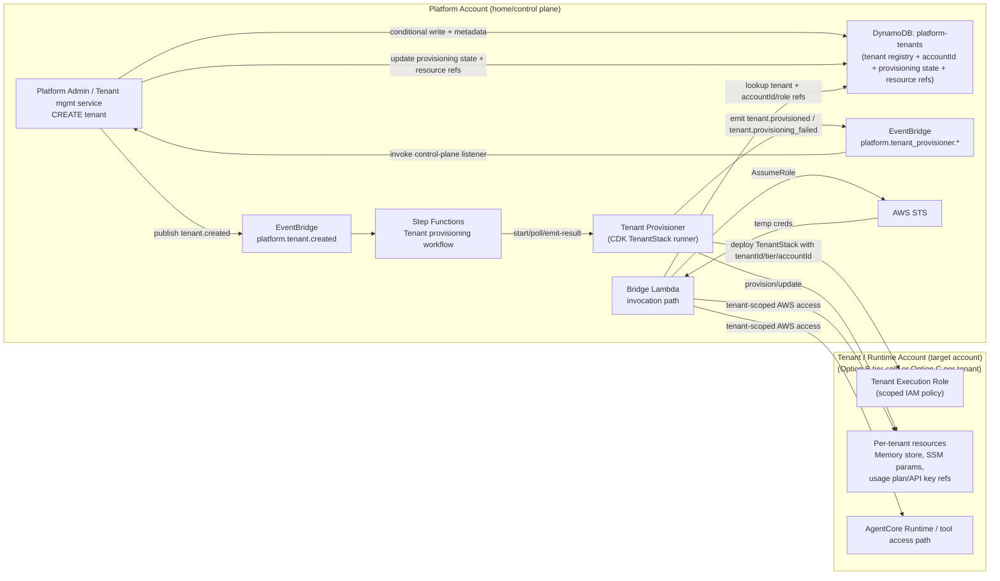

# Architecture

> See also: [Diagram Catalog](README.md#diagram-catalog) | [Threat Model](security/THREAT-MODEL.md) | [ADR Index](README.md#architecture-decision-records)

## System Context

The platform exposes a REST API over which B2E users and E2B integrations invoke AI agents. Each tenant
is a business customer with their own isolated data, memory, and tool access. Internally,
agent developer teams push specialised agents to the platform independently of platform
infrastructure releases. Platform operators monitor, scale, and respond to incidents.

## Architecture Overview


**Audience-specific views:**
- [Engineer architecture](images/tf_acore_aas_architecture_engineer.drawio.png) — explicit service interactions and data flows
- [Executive architecture](images/tf_acore_aas_architecture_exec.drawio.png) — business-risk controls and compliance boundaries

## Region Topology

### v0.2 Secure Target

[ADR-023](decisions/ADR-023-v0-2-secure-deployment-contract.md) defines the v0.2
deployment contract:

```
eu-west-2 London (HOME + RUNTIME)
├── one platform VPC
├── REST API Gateway + WAF
├── CloudFront + SPA (S3, CloudFront WebACL provisioned separately in us-east-1)
├── AgentCore Runtime (staging/prod NetworkMode VPC)
├── AgentCore Gateway
├── AgentCore Memory
├── AgentCore Identity
├── AgentCore Observability
├── all DynamoDB tables
├── all S3 buckets
├── Secrets Manager
├── SSM Parameter Store
├── AppConfig
├── EventBridge
├── SQS (webhook delivery retry queue only, not async invocation routing)
├── ElastiCache Serverless Valkey (TPM counter coordination)
├── Bridge Lambda
├── Authoriser Lambda
├── Tenant API Lambda
├── BFF Lambda
└── CloudWatch
```

The v0.2 serving path has no eu-west-1 runtime fallback and no runtime regional
failover. AgentCore Evaluations may remain a non-serving quality gate outside London
when AWS regional support requires it; that exception is not a serving-path failover.

### Current Implementation

The checked-in implementation now uses the ADR-023 v0.2 runtime topology:

```
eu-west-2 London (HOME + RUNTIME)
├── one platform VPC
├── REST API Gateway + WAF
├── CloudFront + SPA (S3, CloudFront WebACL provisioned separately in us-east-1)
├── AgentCore Gateway (native)
├── AgentCore Memory (native)
├── AgentCore Identity (native)
├── AgentCore Runtime (NetworkMode VPC)
├── All DynamoDB tables
├── All S3 buckets
├── Secrets Manager
├── SSM Parameter Store
├── AppConfig
├── EventBridge
├── SQS (webhook delivery retry queue only, not async invocation routing)
├── ElastiCache Serverless Valkey (TPM counter coordination)
├── Bridge Lambda
├── Authoriser Lambda
├── Tenant API Lambda (Modular: lifecycle, webhooks, agents, ops)
├── BFF Lambda
├── CloudWatch (aggregated)
└── Platform identity and shared config

eu-central-1 Frankfurt (EVALUATION)
└── AgentCore Evaluations when AWS regional support requires a non-serving quality gate
```

All data remains in the EU. The old Dublin zigzag is removed from defaults,
tenant execution-role runtime region sets, runtime bootstrap seeds, and the CDK
runtime stack. Runtime VPC mode uses the London platform VPC isolated subnets and
a dedicated AgentCore Runtime security group.

Policy in AgentCore is GA and Gateway policy evaluation is now deny-by-default
when enforced. Dev and staging run the policy in `LOG_ONLY`; production runs it
in `ENFORCE`. The baseline Cedar policy permits only same-account tenant
execution-role callers on the concrete Gateway. The REQUEST interceptor remains
the checked-in source of truth for tenant tool registration, capability, tier,
and act-on-behalf checks before a tool Lambda is invoked. The first
CloudFormation-owned Gateway target is the platform diagnostics MCP Lambda,
with inline schemas, header propagation, tool-registry records, and AppConfig
capability defaults for the read-only operator tools. Specific Cedar
tool-action policies should build from that checked-in target/schema pattern.

Runtime regional failover is disabled for v0.2. A Runtime outage is handled as
a degradation event through [RUNBOOK-001](operations/RUNBOOK-001-runtime-region-failover.md).

Dynamic tenant capability policy uses AppConfig in the home region. AppConfig is
reserved for rollout-sensitive capability policy only; runtime parameters remain
in SSM and tenant/resource metadata remains in DynamoDB. See
[ADR-017](decisions/ADR-017-tenant-capability-configuration-model.md).

### Tenant API Internal Structure

The `src/tenant_api/` directory implements the control plane administrative API. While
the infrastructure (CDK) currently provisions four separate Lambda functions for
concurrency isolation and granular IAM permissions, they all share a common modular
codebase:

- **`handler.py`**: A unified entry point used for local development and unified
  dispatching logic.
- **`tenant_lifecycle.py`**: The central router for tenant-specific operations.
- **`tenant_records.py`**, **`tenant_invites.py`**, **`tenant_sessions.py`**,
  **`tenant_audit_exports.py`**: Specialised modules implementing the core
  business logic for each functional area.
- **`agent_registry.py`**: Handles spécialised agent metadata and versioning logic.
- **`ops_control.py`**: Implements platform-wide administrative operations like
  failover, service health, and quota management.
- **`db_factory.py`** and **`db_utils.py`**: Abstract database access to enforce
  tenant isolation boundaries. Tenant-scoped DynamoDB and S3 factories reject
  non-platform caller/target tenant mismatches before constructing DAL clients;
  scan-capable control-plane clients remain explicit.

This modular design ensures that the business logic is independent of the physical
Lambda deployment topology, allowing for easy consolidation or further splitting
without major code changes.

Tenant lifecycle handlers translate API Gateway body/query details into typed service
inputs before invoking record services. Authorisation remains in the service boundary,
so pure tenant lifecycle tests do not need to construct full Lambda event payloads.

## Request Lifecycle (Synchronous)

This is the current v0.2 request lifecycle. The serving Runtime is in `eu-west-2`
VPC mode; `eu-west-1` is not a serving fallback.


```
Client
  → CloudFront (CSP headers, edge caching, CloudFront WebACL via us-east-1 edge stack)
  → REST API Gateway (usage plan throttle, WAF)
  → Authoriser Lambda eu-west-2
      Validates Entra JWT (JWKS cached 5min in /tmp)
      Checks roles claim for admin routes
      Returns tenant context: tenantid, appid, tier, sub
      Returns usageIdentifierKey for usage plan enforcement
  → Bridge Lambda eu-west-2
      Reads invocation_mode from DynamoDB agent registry
      Resolves executionRoleArn from tenant metadata
        (fallback: SSM /platform/tenants/{tenantId}/execution-role-arn)
      Validates IAM role ARN/account match, then assumes tenant execution role via STS
        Role policy authorises AgentCore runtime invocation only in the approved
        runtime region set (v0.2: eu-west-2 only)
      Reads active runtime region from SSM (cached 60s)
      Invokes AgentCore Runtime in the active runtime region (default eu-west-2)
        via bedrock-agentcore SDK
      Writes INVOCATION record to DynamoDB on completion
  → AgentCore Runtime eu-west-2
      Firecracker microVM isolation per session
      NetworkMode VPC using isolated platform VPC subnets and runtime security group
      Calls tools via AgentCore Gateway eu-west-2
      Gateway policy engine: Cedar evaluation (LOG_ONLY in dev/staging, ENFORCE in prod)
      Gateway REQUEST interceptor: issues scoped act-on-behalf token
      Tool Lambda eu-west-2: executes with scoped token
      Gateway RESPONSE interceptor: filters by tier, redacts PII
  → Response stream back through bridge → API Gateway → client
```

Implementation note: the Bridge still deploys as one Lambda, but the package is
now split internally into `config_provider`, `discovery_service`,
`invocation_engine`, `runtime_orchestrator`, and `runtime_invoker` so routing,
discovery, and degradation handling can evolve independently without changing the
current public invoke contract. TASK-902 provisions the eu-west-2 ElastiCache Serverless
Valkey counter store and publishes its endpoint per environment at
`/platform/{env}/config/valkey-endpoint`; the Bridge receives the same resolved
endpoint through `VALKEY_ENDPOINT` so TPM log-only accounting does not require a
new request-path SSM permission. ElastiCache Serverless places the cache
endpoint in the selected subnets and security groups; no additional user-managed
ElastiCache interface endpoint is required for counter traffic. Bridge remains
outside the VPC under ADR-014; TASK-903's counter client is fail-open and
endpoint-gated, while any move to hard enforcement still requires an approved
narrow adapter or runtime-network design.

Current SPA edge posture: the public SPA distribution is protected by a dedicated
CloudFront-scope WebACL that must be provisioned in **us-east-1**. AWS WAF requires
CloudFront-scoped web ACLs and their supporting resources to be created in the global
CloudFront region, which is US East (N. Virginia). The repository therefore separates
edge security from the eu-west-2 home-region platform stack:

- `platform-edge-security-<env>` deploys in **us-east-1** and creates the SPA
  `Scope=CLOUDFRONT` web ACL plus its alarms.
- `platform-core-<env>` deploys in **eu-west-2** and attaches the web ACL to the SPA
  distribution through the `spaWebAclArn` CDK context value.

Deployment requirement:

1. Deploy the edge-security stack in **us-east-1**.
2. Capture the `SpaWebAclArn` output from that stack.
3. Deploy or update the home-region core stack with
   `-c spaWebAclArn=<edge-web-acl-arn>`.

Without `spaWebAclArn`, the SPA distribution synthesizes without `WebACLId`, which is
acceptable only for local/test synthesis and must not be the production posture.

### Public Ingress Domain and TLS Posture

The platform exposes two public endpoints to tenants and end users:

| Endpoint | Service | Custom Domain Context | Certificate Region |
|----------|---------|----------------------|-------------------|
| SPA (frontend) | CloudFront | `spaDomainName` + `spaCertificateArn` | us-east-1 (CloudFront requirement) |
| REST API (northbound) | API Gateway (regional) | `apiDomainName` + `apiCertificateArn` | eu-west-2 (same as endpoint) |

**TLS posture:**
- CloudFront: `TLSv1.2_2021` minimum protocol version, SNI-only when using a custom
  certificate. This is enforced in CDK and tested regardless of whether a custom domain
  is configured.
- API Gateway: `TLS_1_2` security policy when a custom domain is wired.
- Both endpoints redirect HTTP to HTTPS.

**Domain configuration:**
- Custom domains are opt-in via CDK context. When absent, CloudFront uses the default
  `*.cloudfront.net` domain and the API uses the default execute-api endpoint. This is
  acceptable for dev/test but not for production.
- For production, set `spaDomainName`, `spaCertificateArn`, `apiDomainName`, and
  `apiCertificateArn` in the CDK context (e.g. `cdk.json` or `-c` flags).
- CORS origin configuration automatically uses the custom SPA domain when configured.

**Certificate ownership and renewal:**
- ACM certificates are AWS-managed. DNS-validated ACM certificates auto-renew as long
  as the validation CNAME records remain in the hosted zone.
- The platform team owns certificate provisioning and DNS record management.
- SPA certificate must be provisioned in **us-east-1** (CloudFront global requirement).
- API certificate must be provisioned in **eu-west-2** (regional API Gateway requirement).
- Certificate ARNs are passed as CDK context, not hardcoded — the certificates are
  provisioned outside this CDK app (manually or via a separate stack) so that certificate
  lifecycle does not couple to application deployments.

**DNS responsibilities:**
- SPA: create a CNAME or Route 53 alias record pointing the custom domain to the
  CloudFront distribution domain name.
- API: create a CNAME or Route 53 alias record pointing the custom domain to the
  regional domain name output (`ApiRegionalDomainName`).
- Both domain names and regional targets are published to SSM Parameter Store for
  operational reference.

**Custom SPA certificate expectations:**
- `spaDomainName` and `spaCertificateArn` are a required pair. The platform rejects
  partial configuration at synth time instead of letting CloudFront fail later.
- `spaCertificateArn` must reference an ACM certificate in **us-east-1** and, by
  default, in the same AWS account as the stack being deployed.
- The certificate subject alternative names must cover the exact custom SPA hostname
  configured in `spaDomainName` (for example `app.example.com` or a wildcard that
  validly covers it).
- DNS cutover is the operator's responsibility: keep the ACM validation records in
  place for renewal, and point the SPA hostname at the CloudFront distribution only
  after the certificate is issued and covers the requested hostname.

## Invocation Modes

Two modes, declared in agent `pyproject.toml` under `[tool.agentcore]` as
`invocation_mode`.
Never inferred. Bridge Lambda routes based on declared mode.
See [ADR-005](decisions/ADR-005-declared-invocation-mode.md).

| Mode | Timeout | Response | Use for |
|------|---------|----------|---------|
| **sync** | 15 min | Direct full response | Interactive queries, classification, tool lookups |
| **streaming** | 15 min | SSE chunked via Lambda response streaming | Chat interfaces, narrated reasoning |

**Async status:** v0.2 does not support async invocation. Earlier design accepted
`async` agents with `202 Accepted`, but that only created pending job records without
a native AgentCore completion path owned by the platform. The bridge now rejects async
agents instead of creating dead jobs. Existing job polling and webhook delivery
surfaces remain for terminal job records, but they are not an async execution backend.
See [ADR-024](decisions/ADR-024-defer-async-invocation-for-v0-2.md).

## Interactive AG-UI Path (Proposed)

The current approved northbound invoke path remains the REST control plane:
CloudFront → REST API Gateway → Authoriser Lambda → Bridge Lambda →
AgentCore Runtime.

AgentCore AG-UI is a proposed additive path for human interactive experiences in
the SPA. It is not a replacement for the REST bridge and is not the canonical
public API for E2B tenant integrations.

Proposed AG-UI shape:

```text
SPA
  → Platform bootstrap endpoint
      Validates Entra identity and tenant context
      Confirms agent is AG-UI-capable
      Records AG-UI bootstrap/session metadata in platform-sessions
      Returns constrained AG-UI connection details
  → Per-agent AgentCore AG-UI runtime
      SSE or WebSocket interactive session
      Human-facing real-time interaction only
```

Design constraints:
- REST remains the supported machine/API invocation path
- AG-UI is per-agent, not a shared runtime
- No Cognito is introduced; any AG-UI auth flow must remain compatible with the
  Entra-first identity model
- Platform bootstrap remains the policy and audit boundary for AG-UI sessions

See [ADR-018](decisions/ADR-018-agentcore-ag-ui-integration.md).

## Tenant Isolation Model

Isolation enforced at five independent layers. A single-layer breach does not
compromise tenant data. See [Threat Model](security/THREAT-MODEL.md) for attack surface analysis.

| Layer | Component | Enforcement |
|-------|-----------|-------------|
| 1 | REST API Authoriser | Validates JWT, rejects invalid/suspended tenants and unavailable tenant-status storage |
| 2 | Bridge Lambda | Assumes tenant-specific IAM execution role via STS |
| 3 | Gateway Cedar policy | Deny-by-default when enforced; permits only tenant execution roles on the Gateway |
| 4 | Gateway Interceptors | Issues scoped act-on-behalf token; tier-filtered tool access |
| 5 | data-access-lib | `TenantScopedDynamoDB` raises `TenantAccessViolation` on cross-tenant access |

See [ADR-004](decisions/ADR-004-act-on-behalf-identity.md) for the identity propagation design.

### Reserved Internal Tenant

The platform defines one reserved internal tenant identifier: `platform`.

This tenant is used only for platform-owned control-plane agents and operator-assisted
automation. It is not assignable to customer tenants and is rejected by tenant
creation flows.

The `platform` tenant is still a real tenant context for observability and audit:
- every request carries `tenantid=platform`
- every log line, metric, and trace annotation includes `tenantid=platform`
- the acting operator or service principal is recorded alongside the platform tenant
  context

The `platform` tenant is not a super-tenant. It does not receive implicit cross-tenant
data access. Any action against a customer tenant must flow through explicit
control-plane APIs or workflows that:
- validate the target tenant
- enforce platform RBAC
- emit audit events
- preserve target-tenant identity in downstream actions

See [ADR-016](decisions/ADR-016-platform-internal-tenant.md) for the reserved internal
tenant model.

## Request Lifecycle (Platform Operator / Internal Agent)

```text
Operator
  → SPA / Admin surface
  → Entra OIDC
  → REST API Gateway
  → Authoriser Lambda
      Validates Entra JWT
      Confirms platform role claims (for example Platform.Admin / Platform.Operator)
      Returns caller context with tenantid=platform for platform-agent routes
  → Platform Agent / Control-Plane Handler
      Operates within reserved tenant `platform`
      May inspect platform-owned control-plane state directly where authorised
      Must use explicit admin/control-plane APIs or workflows for target-tenant actions
      Emits audit records including:
        acting principal
        tenantid=platform
        targetTenantId (when applicable)
        operation type
        outcome
  → Response back through API Gateway → client
```

Design rule: platform agents assist and orchestrate control-plane operations; they do
not bypass the control plane.

### Read-Only Platform-Agent Diagnostics Surface

The bounded read-only platform-agent surface is intentionally narrow and limited to
authoritative control-plane signals:

- `GET /v1/platform/agents`: canonical release and governance state from
  `platform-agents`
- `GET /v1/platform/quota`: live quota utilisation from Service Quotas and CloudWatch
- `GET /v1/platform/billing/status`: billing summaries from control-plane records

These routes may be summarized by platform-agent runbook assistance because they
stay within platform-owned control-plane state and do not require direct customer
invocation content.

The diagnostics MCP tool follows the same rule. `get_platform_health` is derived
from recent `platform-invocations` records and reports `unknown` when that signal
is absent or unavailable. `get_recent_errors` returns invocation error records
from the same audit table; it does not synthesize security events.

The compatibility `/v1/platform/service-health` route does not yet have
authoritative service-health aggregation behind it. Until that exists, it reports
`unknown` with no per-service map rather than synthesizing a green platform state.

The following are explicitly outside the read-only platform-agent diagnostics surface
unless and until they are reintroduced with authoritative backing:

- synthetic or de-scoped `/v1/platform/ops/*` summary endpoints
- raw customer invocation/session convenience views
- AG-UI bootstrap/runtime connectivity flows
- mutating control-plane actions such as failover, release promotion, rollback, or
  agent registration

## Configuration Ownership Model

The platform splits configuration ownership by change semantics rather than by
team preference:

| Store | Owns | Does not own |
|-------|------|--------------|
| **AppConfig** | Dynamic tenant capability policy: tier feature enablement, capability flags, kill switches, model/tool availability, rollout controls. **Runtime parameters:** active runtime region, mock service URLs. | Tenant state, resource inventory, execution-role ARNs, memory-store ARNs |
| **SSM Parameter Store** | Operational bootstrap identifiers: AppConfig application/environment/profile IDs. Legacy/fallback platform parameters. | Tenant feature policy, invocation state, hot-path runtime settings |
| **DynamoDB** | Tenant metadata and transactional state: status, budgets, execution-role ARN, memory-store ARN, audit/job/session records | Rollout-managed capability toggles |
| **`.env.example` + `platform_config`** | Local script and developer-tool settings validated by Pydantic before use. | Runtime tenant state, secrets storage, rollout policy |

Control-plane Lambdas (Bridge, Authoriser, Admin APIs) leverage the **AWS AppConfig Lambda Extension**
to cache all policy and runtime configuration locally. This eliminates the high-latency network
round-trip to SSM/AppConfig APIs on the hot path, bringing configuration access down to **sub-millisecond**
latency.

The extension layer ARN is an explicit deployment input, supplied through the
`appConfigExtensionLayerArn` CDK context value. Repository Make targets pass this
from `APPCONFIG_EXTENSION_LAYER_ARN`. The CDK app fails synthesis when that value
is absent or blank; it does not carry a built-in AWS account-specific layer ARN.
Operators should use the current AWS-managed ARM64 AppConfig Lambda Extension
layer ARN for the target region, from the AWS AppConfig extension version table:
`https://docs.aws.amazon.com/appconfig/latest/userguide/appconfig-integration-lambda-extensions-versions.html`.

Control-plane Lambdas evaluate configuration with deny-by-default fallback semantics: use the last known
good AppConfig document when available, otherwise fall back to an empty policy (for capabilities) or
the ADR-approved regional default (for runtime settings). Kill switches override all rollout rules.
Rollback of configuration changes uses AppConfig version history rather than ad hoc DynamoDB edits.
Capability and regional changes deploy through a bounded rollout strategy with bake time.

### Safe Defaults And Fallbacks

- **AppConfig** is the primary source for runtime and capability policy. If a fetch from the local
  extension fails, handlers attempt a direct fallback to SSM; if that also fails, they use an
  explicitly approved operational default defined in code.
- **SSM Parameter Store** remains for administrative and bootstrap reference. Missing or invalid SSM
  values must never widen tenant capability access.
- **DynamoDB** remains authoritative for tenant metadata and transactional state.
  If required tenant or resource records are absent, handlers fail the specific
  operation rather than rebuilding tenant state from AppConfig documents or SSM
  parameters.

## Entity Lifecycle


## Data Model (DynamoDB Tables)

See [ADR-012](decisions/ADR-012-dynamodb-capacity.md) for capacity mode rationale.

**platform-tenants** — tenant registry
- PK: `TENANT#{tenantId}`, SK: `METADATA`
- Attributes: tenantId, appId, displayName, tier, status, createdAt, updatedAt,
  provisioningStatus, provisioningUpdatedAt, provisioningError, ownerEmail,
  ownerTeam, executionRoleArn, memoryStoreArn, runtimeRegion,
  apiKeySecretArn, monthlyBudgetUsd, accountId
- Control-plane metadata only. Do not store high-frequency invocation counters,
  last-activity markers, or session heartbeat state in this row.
- Excludes dynamic capability policy. Capability flags, kill switches, and
  rollout-managed model/tool availability live in AppConfig, not in this table.
- Capacity: on-demand
- Tenant ID policy (create boundary):
  - Canonicalized to lowercase before persistence
  - Regex: `^[a-z](?:[a-z0-9-]{1,30}[a-z0-9])$` (3–32 chars)
  - No consecutive hyphens; reserved IDs rejected (`platform`, `admin`, `root`, `system`, `stub`)
  - Existing pre-policy tenant IDs remain valid; policy enforced for new creates only
  - `platform` is reserved for internal control-plane use and must never be created
    through customer or self-service flows

Reserved tenant ID access semantics:

| Tenant ID | Create | Read | Update | Delete | Caller role requirement |
|-----------|--------|------|--------|--------|-------------------------|
| `platform` | Denied through tenant creation APIs; seeded only by controlled bootstrap/provisioning paths | Allowed for the seeded `platform` tenant record | Allowed for mutable metadata on the seeded `platform` tenant record | Denied; the platform tenant must remain addressable for audit and control-plane identity | `Platform.Admin` for direct `/v1/tenants/platform` read/update; platform-agent routes require the route-specific platform RBAC documented above |
| `admin` | Denied | Denied | Denied | Denied | No tenant API caller role may operate on this ID |
| `root` | Denied | Denied | Denied | Denied | No tenant API caller role may operate on this ID |
| `system` | Denied | Denied | Denied | Denied | No tenant API caller role may operate on this ID |
| `stub` | Denied | Denied | Denied | Denied | No tenant API caller role may operate on this ID |

The non-`platform` reserved IDs are guard words only. They must not be backfilled as
tenant records, exposed as first-class control-plane tenants, or made assignable by
operator role. Any future change that allows reads or writes for one of these IDs
requires an explicit ADR because it changes the tenant identity boundary.

**platform-agents** — agent registry
- PK: `AGENT#{agentName}`, SK: `VERSION#{semver}`
- Attributes: agentName, version, ownerTeam, tierMinimum, layerHash,
  layerS3Key, scriptS3Key, runtimeArn, runtimeEndpointArn,
  runtimeEndpointName, runtimeEndpointVersion, deployedAt, invocationMode,
  streamingEnabled, estimatedDurationSeconds, status, approvedBy,
  approvedAt, releaseNotes
- Capacity: on-demand

The runtime endpoint fields bind a promoted agent version to the v0.2
`AWS::BedrockAgentCore::RuntimeEndpoint` selected during registration. Bridge
validates that the endpoint ARN belongs to the recorded runtime ARN before
invocation, then passes the endpoint name as the AgentCore `qualifier` and the
platform session ID as `runtimeSessionId` when one is supplied.

### Agent Release State Source Of Truth

The release state of an immutable built agent version is owned by
`platform-agents.status` in DynamoDB. The canonical lifecycle is:

`built -> deployed_staging -> integration_verified -> evaluation_passed -> approved -> promoted`

Terminal branches:
- `failed` from any pre-promoted gate
- `rolled_back` from `promoted`

Only `promoted` versions are tenant-invokable. The Bridge resolves the active
version as the highest semver record for an agent where `status=promoted`.
Rollback is a forward metadata transition on the bad version; the Bridge then
falls back to the next-highest promoted version without rebuilding artifacts.

### Release Lifecycle Audit Events

Promotion and rollback are control-plane mutations owned by the agent registry
service. After the `platform-agents` record is updated successfully, the agent
registry service emits one
EventBridge event on the platform event bus with detail type:

- `platform.agent_version.promoted`
- `platform.agent_version.rolled_back`

Event detail schema:

| Field | Meaning |
|-------|---------|
| `schemaVersion` | Payload schema version for downstream consumers |
| `operation` | `promotion` or `rollback` |
| `occurredAt` | ISO 8601 UTC timestamp for the persisted transition |
| `actorTenantId` / `actorAppId` / `actorSub` | Control-plane actor identity; platform-operated routes should carry `tenantid=platform` |
| `releaseId` | Stable immutable release identifier: `{agentName}:{version}` |
| `agentRecordPk` / `agentRecordSk` | Stable DynamoDB identifiers for the release record |
| `agentName` / `version` | Human-readable release identifiers |
| `previousStatus` / `status` | Canonical lifecycle transition |
| `approvedBy` / `approvedAt` | Approval evidence attached to the release, when present |
| `releaseNotes` | Operator-supplied promotion or rollback evidence |
| `evaluationScore` / `evaluationReportUrl` | Evaluation evidence recorded on promotion, when supplied |
| `rolledBackBy` / `rolledBackAt` | Rollback actor and timestamp, when the transition is `rolled_back` |

Semantics:
- emitted only for the auditable terminal control-plane transitions covered by ADR-015: `approved -> promoted` and `promoted -> rolled_back`
- emitted after the DynamoDB update succeeds, so consumers never observe a promotion or rollback that failed persistence
- one event per successful transition; consumers should treat `releaseId` plus `status` as the stable release transition identity and may also use the EventBridge envelope `id` for delivery-level deduplication

Operational consumers:
- operator-facing release dashboards and timelines
- compliance/audit export pipelines that need immutable release history
- downstream release automation that reacts to confirmed promotion or rollback state changes

**platform-invocations** — invocation audit log
- PK: `TENANT#{tenantId}`, SK: `INV#{timestamp}#{invocationId}`
- Attributes: invocationId, tenantId, appId, agentName, agentVersion,
  sessionId, inputTokens, outputTokens, latencyMs, status, errorCode,
  runtimeRegion, invocationMode, jobId, ttftMs
- This is the high-frequency tenant activity record for invocations. Do not
  mirror per-request counters or last-seen markers into `platform-tenants`.
- `ttftMs` is populated only for streaming invocations after the first non-empty
  runtime chunk arrives. Non-streaming records store it as null; streaming records
  that complete without a chunk also leave it null.
- TTL: 90 days. Capacity: on-demand (unpredictable volume)
- Hot partition protection: SK includes random jitter suffix for high-volume tenants

**platform-jobs** — terminal job record tracking for deferred async surfaces
- PK: `TENANT#{tenantId}`, SK: `JOB#{jobId}`
- Attributes: jobId, tenantId, agentName, status, createdAt, startedAt,
  completedAt, resultS3Key, errorMessage, webhookUrl, webhookDelivered
- TTL: 7 days. Capacity: on-demand

**platform-sessions** — active session tracking
- PK: `TENANT#{tenantId}`, SK: `SESSION#{sessionId}`
- Attributes: sessionId, runtimeSessionId, agentName, startedAt, lastActivityAt, status
- AG-UI bootstrap records may also include appId, bootstrapRequestId, transport,
  and connectUrl so the control plane retains session start evidence with appid+tenantid.
- Session liveness and last-activity state belong here, not in `platform-tenants`.
- TTL: 24 hours after last activity

**platform-tools** — Gateway tool registry
- PK: `TOOL#{toolName}`, SK: `TENANT#{tenantId}` or `GLOBAL`
- Attributes: tool_name, tier_minimum, lambda_arn, gateway_target_id, enabled
- The registry and REQUEST interceptor are the current checked-in source of truth
  for tool-level authorization. Do not add specific Cedar tool-action policies
  until Gateway targets or tool schemas are also owned in version control and
  validated in the same deployment path.

**platform-ops-locks** — distributed operation locks
- PK: `LOCK#{lockName}`, SK: `METADATA`
- Attributes: lockId, acquiredBy, acquiredAt, ttl (5-minute auto-expire)
- Used for: account scaling transitions. Historical runtime region failover locks
  are not part of the ADR-023 v0.2 topology.

## Scaling Model

Five independent scaling layers. Each layer has a monitoring threshold and a
documented response in the [operator runbooks](README.md#operator-runbooks).

| Layer | Mechanism | Limits | Monitoring / Response |
|-------|-----------|--------|----------------------|
| 1 | REST API usage plans | basic: 10 rps / 1K/day, standard: 50 rps / 10K/day, premium: 500 rps / unlimited | Native API Gateway 429 |
| 2 | Bridge Lambda concurrency | 200 prod, 50 staging | Alert at 80%; provisioned concurrency 10 on authoriser |
| 3 | AgentCore Runtime | Auto-scales, per-account quota | 70%: [RUNBOOK-002](operations/RUNBOOK-002-quota-monitoring.md); 90%: [RUNBOOK-004](operations/RUNBOOK-004-quota-increase.md) |
| 4 | DynamoDB | All tables on-demand | Jitter suffix on high-volume tenant SKs |
| 5 | Account topology | Option A (single) → B (tier-split) → C (per-tenant) | Escalate when quota thresholds require |

## Platform-Controlled Cross-Tenant Actions

Cross-tenant actions are permitted only through explicit control-plane paths. The
reserved `platform` tenant does not authorize broad direct access to customer data.

Approved cross-tenant actions must:
- originate from a caller with platform RBAC
- record both acting tenant (`platform`) and target tenant
- execute through documented admin APIs, workflows, or orchestrations
- preserve tenant isolation for all direct data-plane access

This preserves the rule that normal tenant data access remains structurally
tenant-scoped even when initiated by platform-owned automation.

## Platform-Agent Action Classes

The reserved `platform` tenant exists to let platform-owned agents assist operators
inside the control plane. It does not create a new privileged data path.

Allowed action classes:
- **Read-only platform diagnostics and runbook guidance** on platform-owned control-plane
  state and authoritative operational signals. Diagnostics tool Lambdas must require
  a validated Gateway scoped token; raw request headers such as `x-tenant-id:
  platform` are not an authorization source. The Gateway request interceptor mints
  platform-diagnostics scoped tokens with the effective `platform` tenant only for
  callers carrying platform operator/admin roles.
- **Release-governance assistance** through the existing agent registry lifecycle,
  including register, approve, promote, and rollback actions that already belong to
  the control plane
- **Tenant-operations workflow initiation** through explicit admin routes or
  orchestrations such as suspend/reinstate, tenant notifications, and other
  bounded operational remediations
- **Platform-state summarisation** that helps an operator understand health, drift,
  or release state without exposing raw customer content as a shortcut

Disallowed action classes:
- direct reads or writes against arbitrary customer-tenant stores outside approved
  control-plane workflows
- treating `tenantid=platform` as implicit authorization to bypass RBAC, audit, or
  target-tenant validation
- direct mutation of immutable release artifacts or destructive edits to
  `platform-agents` outside the ADR-015 lifecycle contract
- AG-UI bootstrap or browser/runtime session design; that follow-on work is tracked
  separately under the AG-UI issue set and is not part of the platform-agent backlog
  defined here
- policy-sensitive mutations called out in [CLAUDE.md](../CLAUDE.md) as stop-and-ask
  changes, including IAM trust changes, KMS key policy changes, and authoriser
  validation logic changes

Required boundary rules:
- every platform-agent route must require explicit platform RBAC
- every cross-tenant action must capture acting principal, acting tenant, target tenant,
  operation type, and outcome
- mutation flows must reuse documented admin/control-plane APIs or workflows instead of
  inventing a parallel data-plane path
- customer invocation content is never exposed merely because the caller is internal;
  access must stay within the documented control-plane contract

### Follow-On Backlog For Platform-Agent Operations

GitLab issue `#318` closes only after the
follow-on implementation backlog is explicit. The scoped follow-on work is:

| Issue | Focus | Why it exists |
|-------|-------|---------------|
| `#388` | Platform-agent auth context and audit envelope | Makes `tenantid=platform` explicit, auditable, and non-bypassable |
| `#389` | Read-only diagnostics and runbook assistance | Keeps operator-assistance flows bounded to authoritative read-only signals |
| `#390` | Tenant operational workflows | Forces target-tenant actions through explicit admin workflows with validation and audit |
| `#391` | Release-governance workflows | Reuses the ADR-015 lifecycle instead of hidden scripts or direct table mutation |

Out of scope for this backlog:
- AG-UI bootstrap, runtime session contracts, and SPA integration, which are already
  tracked separately in GitLab issues `#381`, `#382`, `#383`, `#384`, and `#385`
- any design that weakens the reserved-tenant guardrails from ADR-016 or the stop-and-ask
  security boundaries in [CLAUDE.md](../CLAUDE.md)

### Cross-Account Tenant Provisioning (Option B/C)

Account-boundary rule: [ADR-019](decisions/ADR-019-tenant-execution-role-account-boundary.md)
defines the current tenant execution-role model as **`same-account only`**.
Option B/C account vending exists as a future quota-relief topology, but the
current Bridge execution-role path does not yet support a cross-account tenant
execution role end-to-end. A matching role name in another account is not
sufficient, and any future cross-account mode requires a successor
`cross-account allow-list` design.



## CDK Stack Dependencies


**Audience-specific views:**
- [Engineer CDK dependencies](images/tf_acore_aas_cdk_dependencies_engineer.drawio.png) — code-level dependency relationships
- [Executive CDK dependencies](images/tf_acore_aas_cdk_dependencies_exec.drawio.png) — planning and governance view

See [ADR-007](decisions/ADR-007-cdk-terraform.md) for the CDK vs Terraform split rationale.

### Deployment Order

| Order | Stack | Region | Resources |
|-------|-------|--------|-----------|
| 1 | NetworkStack (`platform-network-{env}`) | eu-west-2 | VPC, subnets, VPC endpoints, security groups |
| 2 | IdentityStack (`platform-identity-{env}`) | eu-west-2 | GitLab OIDC WIF roles, Entra JWKS runtime config |
| 3 | PlatformStorageStack (`platform-storage-{env}`) | eu-west-2 | DynamoDB tables, AppConfig application, capability profile, deployment strategy |
| 4 | PlatformSpaStack (`platform-spa-{env}`) | eu-west-2 | SPA S3 bucket, CloudFront distribution, CSP response headers |
| 5 | PlatformStack (`platform-core-{env}`) | eu-west-2 | REST API, WAF, Bridge, BFF, Authoriser, AgentCore Gateway; exports SPA CloudFront distribution metadata |
| 6 | PlatformEdgeSecurityStack (`platform-edge-security-{env}`) | us-east-1 | CloudFront-scope WAF web ACL for SPA; consumes SPA distribution metadata from PlatformStack |
| 7 | TenantStack (`platform-tenant-{tenantId}-{env}`) | eu-west-2 | Per-tenant execution role, memory store, usage plan key, SSM |
| 8 | ObservabilityStack (`platform-observability-{env}`) | eu-west-2 | Dashboards, alarms, monitoring-account OAM sink only |
| 9 | AgentCoreStack (`platform-agentcore-{env}`) | eu-west-2 | Runtime config; VPC mode; no cross-region metric stream |

TenantStack deploys per-tenant through the tenant provisioning Step Functions
workflow, which is started by EventBridge `platform.tenant.created` and
completes by emitting `platform.tenant_provisioner` completion events back to
the control plane. The supported path is same-account only: tenant create,
TenantStack start, and provisioning completion all reject a non-home `accountId`.
It is **not** deployed by the platform pipeline.
Existing tenants are migrated/verified with `make ops-backfill-tenant-role-arn [APPLY=1]`.

The storage and SPA split described in [ADR-703](decisions/ADR-703-platformstack-split-plan.md)
has been implemented. `platform-storage-{env}` owns all DynamoDB tables and AppConfig
resources; `platform-spa-{env}` owns the SPA CloudFront distribution and backing S3 bucket.
`platform-core-{env}` retains its name so that Lambda function names (which embed
`${this.stackName}`) remain stable. Compute, orchestration, the REST API, WAF,
and AgentCore Gateway continue to deploy from `platform-core-{env}`.
See `infra/cdk/bin/app.ts` for the authoritative instantiation and dependency order.

ObservabilityStack currently provisions the eu-west-2 monitoring-account OAM sink only.
No regional OAM member links are deployed yet. Runtime metrics are read in the serving
region; the old eu-west-1 metric stream is not part of the v0.2 topology.

## Validation Sources Of Truth

Version truth is release-oriented, not write-oriented. The product semver must match
across `pyproject.toml`, both package manifests, both package lockfiles, `docs/openapi.yaml`,
and `docs/DOCS_SYNC.json`. `make docs-sync-audit` is the validation source; `make
docs-sync-stamp` refreshes the release checkpoint when code and docs are intentionally
aligned.

CDK generated output is local state. `infra/cdk/cdk.out/` may exist after synth, but it
must remain ignored and untracked. The retired `infra/cdk/generated/` cache must not
return. `make generated-state-audit` enforces that policy and runs with local and
pre-push validation.

Pre-push validation has one composition source: `platform-cli validate local pre-push`.
The Make target and Git hook delegate to that validator. The pre-push mode keeps the
fast guardrails, then adds runtime tests when the branch changes runtime code:
Python changes run a changed unit-test subset only when every Python change is either
itself a unit test or has an explicit source-to-test mapping, and otherwise fall back
to `test-unit`; SPA changes run the documented quick Vitest suite through
`npm run test:quick`.

## Failure Modes

| ID | Failure | Detection | Alarm | Response |
|----|---------|-----------|-------|----------|
| FM-1 | Runtime region unavailable | `ServiceUnavailableException` | `FM-1-RuntimeRegionUnavailable` | [RUNBOOK-001](operations/RUNBOOK-001-runtime-region-failover.md) degradation procedure |
| FM-2 | Authoriser cold start spike | P99 > 500ms | `FM-2-AuthoriserColdStartSpike` | Provisioned concurrency |
| FM-3 | Secrets Manager throttling | Cache miss rate | `FM-3-SecretsManagerThrottling` | By design (Lambda /tmp cache with TTL) |
| FM-4 | DynamoDB hot partition | Throttle events on invocations table | `FM-4-DynamoDbHotPartition` | Jitter suffix on SK |
| FM-5 | Bridge Lambda timeout | 504 to client | `FM-5-BridgeTimeout` | 16-min Lambda timeout |
| FM-6 | Interceptor retry storm | Interceptor error rate | `FM-6-InterceptorRetryStorm` | Idempotency key |
| FM-7 | AgentCore Memory unavailable | Degraded mode metric | `FM-7-AgentCoreMemoryDegraded` | Agent runs without long-term memory |
| FM-8 | Usage plan quota exhausted | 429 from API Gateway | `FM-8-UsagePlanQuotaExhausted` | By design (native enforcement) |
| FM-9 | DLQ message arrival | DLQ CloudWatch alarm | `FM-9-DLQ-Arrival-{name}` | [RUNBOOK-005](operations/RUNBOOK-005-dlq-management.md) |
| FM-10 | Billing Lambda failure | Billing Lambda errors | `FM-10-BillingLambdaFailure` | [RUNBOOK-006](operations/RUNBOOK-006-budget-and-suspension.md) |
| FM-11 | Bedrock runtime throttle pressure | Bridge emits `Invocation.Throttled.Bedrock` | `FM-11-BedrockThrottlePressure` | Investigate noisy tenants, concurrency pressure, and runtime quota headroom |
| FM-12 | Valkey unavailable | Bridge emits `valkey_unavailable` fail-open metric/log | `FM-12-ValkeyUnavailable` | Bridge continues with fail-open (TPM check skipped, metric emitted) |

Bridge invocation, Bedrock throttle, TPM limit, and TPM window-usage metrics carry
both `TenantId` and `AppId` dimensions when tenant context exists. Tenant-only
views are not sufficient for multi-app tenant forensics because CloudWatch custom
metric dimensions are part of metric identity.

Streaming TTFT uses `gen_ai.ttft_ms` in `Platform/Bridge`. The Bridge publishes
the operational series with `AgentName`, `InvocationMode=streaming`, and
`RuntimeRegion`; a matching `AgentName=all` / `RuntimeRegion=all` series feeds the
disabled placeholder alarm. CloudWatch custom metric dimensions are part of metric
identity and are not aggregated automatically, so both supported query shapes are
published deliberately. ObservabilityStack includes a disabled
`FM-2-StreamingTTFTPlaceholder` alarm shell on p99 TTFT. Operators must set the
AG-UI SLO threshold from production data before enabling alarm actions.

## Security Model

> Full analysis: [Threat Model](security/THREAT-MODEL.md) | [Compliance Checklist](security/COMPLIANCE-CHECKLIST.md)

### Authentication

```
Human user → MSAL.js → Entra OIDC → Bearer JWT → Authoriser Lambda validates
Machine    → SigV4   → Authoriser Lambda validates
Both       → tenantid, appid, tier, roles injected into request context
Admin routes → roles claim must contain Platform.Admin or Platform.Operator
```

### Identity Propagation (Act-on-Behalf)

```
Client JWT validated at authoriser (Layer 1)
Bridge Lambda assumes tenant execution role (Layer 2)
Agent invokes tool via Gateway
REQUEST interceptor issues scoped act-on-behalf token (Layer 3)
Tool Lambda receives scoped token only — never the original user JWT
```

See [ADR-004](decisions/ADR-004-act-on-behalf-identity.md).

### Entra RBAC Mapping

| Entra Group | JWT Claim | Access |
|-------------|-----------|--------|
| platform-admins | `Platform.Admin` | Admin-only routes |
| platform-operators | `Platform.Operator` | Operator routes |
| agent-developers | `Agent.Developer` | Agent push pipeline |
| tenant-basic | `Agent.Invoke` | tier:basic |
| tenant-standard | `Agent.Invoke` | tier:standard |
| tenant-premium | `Agent.Invoke` | tier:premium |

See [ADR-013](decisions/ADR-013-entra-rbac-roles-claim.md).

## Known Constraints

| Constraint | Impact | Mitigation |
|-----------|--------|------------|
| Runtime regional failover is deferred for v0.2 | A London Runtime outage is a platform degradation event | [ADR-023](decisions/ADR-023-v0-2-secure-deployment-contract.md) requires eu-west-2 Runtime, staging/prod VPC mode, and no Dublin fallback |
| AgentCore Gateway timeout: 5 min | Tools cannot exceed 5 min response | Design tools for fast response; long-running platform async is deferred by ADR-024 |
| Code Interpreter: 25 concurrent sessions | Per-account per-region limit | Monitor via [RUNBOOK-002](operations/RUNBOOK-002-quota-monitoring.md) |
| arm64 only in Runtime | All Python deps must be cross-compiled aarch64-manylinux2014 | See [ADR-001](decisions/ADR-001-agentcore-runtime.md) |
| Session idle timeout: 15 min | Long UI sessions require keepalive | BFF keepalive endpoint; BFF secret resolution uses cached values plus retry/jitter on fetch miss; see [ADR-011](decisions/ADR-011-thin-bff.md) |
| REST API sync timeout: 15 min | Not the standard 29s Lambda limit | Lambda configured for 15 min; API Gateway integration timeout matched |
